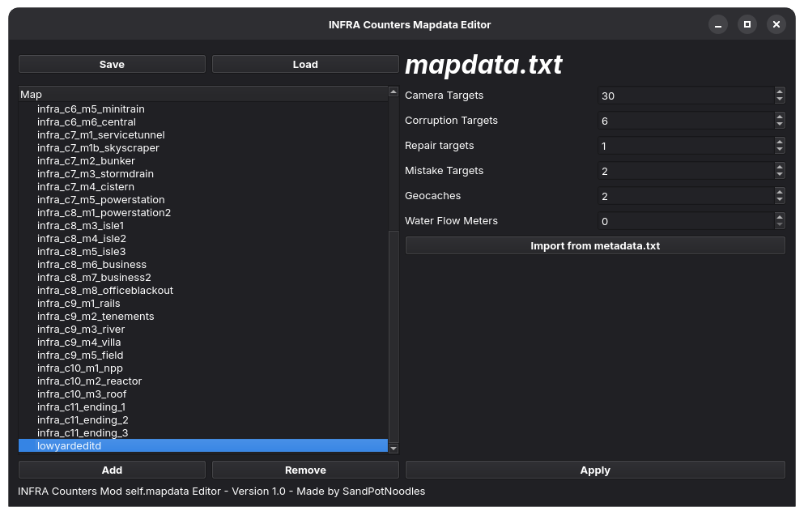

# INFRA Counters Mapdata Editor

A simple GUI to edit the mapdata.txt file used by the INFRA Counters mod.

Also supports reading from the `[mapname]_metadata.txt` file that is made when you compile an INFRA map.

Made in Python btw, also note that while this works on Linux, the INFRA counters mod doesn't really work very well on Linux

## Mapdata.txt isn't included in this software, it's available on the moddb page for the INFRA Counters Mod

yeah

## "Building" it

`pip install vdf`

`pip install pyqt6`

`sandstuff.py also needed` <b> [!] sandstuff doesn't work on Windows as it uses pwd and uname -m, you'll have to patch it</b>

`pip install pyinstaller`

<b>Linux:</b> `pyinstaller --onefile main.py`

<b>Windows/CopilotOS:</b> `pyinstaller -w --onefile main.py`

